```mermaid
flowchart TB
  classDef io fill:#1a1500,stroke:#f5a800,color:#ffd966,rx:4
  classDef dsp fill:#1f1800,stroke:#f5a800,color:#ffe599,rx:8
  classDef cv fill:#1f1600,stroke:#e69500,color:#ffd966,rx:8
  classDef xai fill:#1c1500,stroke:#cc7a00,color:#ffcc44,rx:8
  classDef nlp fill:#1a1300,stroke:#b36b00,color:#ffbb33,rx:8
  classDef fallback fill:#141000,stroke:#996000,color:#ffaa22,rx:6

  IN["WAV / FLAC\n(upload or filepath)"]:::io

  subgraph S1["Stage 1 — Audio DSP  (FR-AUD-001–008)"]
    direction TB
    D1["librosa: load → resample 16 kHz → mono"]:::dsp
    D2["STFT → Mel Spectrogram (128 bins)"]:::dsp
    D3["dB normalisation → resize 224×224"]:::dsp
    D4["1-ch → 3-ch duplicate → float32 tensor"]:::dsp
    D1 --> D2 --> D3 --> D4
  end

  T["Tensor  [3, 224, 224]  float32  CPU"]:::io

  subgraph S2["Stage 2 — CV Inference  (FR-CV-001–009)"]
    direction TB
    M1["ONNX Runtime\nEfficientNet-B4 backbone"]:::cv
    M2["Classifier head: 2 logits\n(bonafide / spoof)"]:::cv
    M3["sigmoid(logit₁) → spoof_score ∈ [0,1]\ndecision_threshold = 0.93"]:::cv
    M1 --> M2 --> M3
  end

  PRED["label ∈ {0,1}  +  confidence float"]:::io

  subgraph S3["Stage 3 — XAI Grad-CAM  (FR-CV-010–016)"]
    direction TB
    G1["Gradients of predicted class\nw.r.t. model.features[-1]"]:::xai
    G2["Global avg-pool → importance weights\n→ weighted feature map + ReLU"]:::xai
    G3["Jet colormap heatmap\n50% overlay on Mel spectrogram"]:::xai
    G4["4-Band Mel attribution\n(Softmax-normalised %)"]:::xai
    G1 --> G2 --> G3 --> G4
  end

  GCAM["heatmap PNG  +  band_pct float[4]"]:::io

  subgraph S4["Stage 4 — NLP Explanation  (FR-NLP-001–006)"]
    direction TB
    N1["build_prompt(label, confidence, band_pct)"]:::nlp
    N2["Qwen2.5-7B-Instruct\n   via HF Inference API (async)"]:::nlp
    N3["Fallback: google/gemma-2-2b-it"]:::fallback
    N4["Fallback: rule-based local fn\n   (no network required)"]:::fallback
    N1 --> N2
    N2 -- timeout/error --> N3
    N3 -- timeout/error --> N4
  end

  EXP["English paragraph  (3–5 sentences)"]:::io

  IN --> S1 --> T --> S2 --> PRED
  T --> S3
  PRED --> S3
  S3 --> GCAM
  PRED --> S4
  GCAM --> S4
  S4 --> EXP
```

<div align="center">

# Fake67: Explainable Deepfake Audio Detection via Spectrograms Using EfficientNet-B4 and GradCAM

*Final Project - Intelligent Computation & Vision Workshop (KCVanguard 2026)*

[](https://python.org)
[](https://gradio.app)
[](https://onnxruntime.ai)
[](https://huggingface.co/spaces)
[](LICENSE)

</div>

---

## 🚨 The Problem

In Indonesia's family WhatsApp groups, a voice note arrives. It sounds *real*. Within minutes it's forwarded thousands of times.

**But the voice was never human.**

We ran a blind listening experiment during Lebaran 2026 with 57 respondents (89.3% Boomers/older adults, the most targeted demographic). The results:

- **~90% were fooled** by AI-generated voices (clips 1 & 3)
- **~20% flagged a *real* human voice** as AI (clip 2)

This is the **Liar's Dividend**: deepfakes don't just make lies believable, they make *truth* suspicious.

Fake67 is our answer: an automated, explainable detection pipeline that goes beyond a yes/no verdict and shows *why* it reached that conclusion.

---

## 🌟 Project Demonstration

<div align="center">


</div>

---

## 🏗️ System Architecture

Fake67 is a **4-stage sequential multimodal pipeline** deployed via Gradio on Hugging Face Spaces:

```
WAV/FLAC → [Stage 1: Audio DSP] → [Stage 2: CV Inference] → [Stage 3: XAI Grad-CAM] → [Stage 4: NLP Explanation]
```



---

## 📂 Project Structure

```
final-fried-kcv/
├── app.py                   # Gradio UI entry point, orchestrates the full pipeline
├── config.yaml              # Central config: model paths, thresholds, NLP settings
├── requirements.txt         # All pinned dependencies
│
├── src/
│   ├── audio/
│   │   └── dsp.py           # Stage 1: raw audio → [3, 224, 224] float32 tensor
│   ├── cv/
│   │   ├── model.py         # EfficientNet-B4 architecture + 2-class head definition
│   │   ├── infer.py         # Stage 2: ONNX Runtime inference → label + confidence
│   │   └── gradcam.py       # Stage 3: Grad-CAM heatmap + 4-band Mel attribution
│   └── nlp/
│       └── explain.py       # Stage 4: Qwen 2.5 async + 3-layer fallback explanation
│
└── notebooks/
    └── dsdba_training.ipynb # Colab training scaffold (EfficientNet-B4, AMP, checkpointing)
```

---

## ⚙️ Stage Details

### Stage 1 — Audio DSP (`src/audio/dsp.py`)

Converts raw audio into a model-ready visual representation:

| Step | Operation | Detail |
|------|-----------|--------|
| Load | `librosa.load()` | Accepts `.wav` / `.flac` |
| Resample | 16 kHz mono | Standardises all inputs |
| STFT | Short-Time Fourier Transform | Splits signal into overlapping windows |
| Mel | 128 Mel filter banks | Aligns with human auditory perception |
| Normalise | dB scale + value compression | Prevents extreme values dominating training |
| Resize | `[224, 224]` | Matches EfficientNet input size |
| Expand | `[1, 224, 224]` → `[3, 224, 224]` | Channel duplication for RGB-pretrained backbone |

**Output contract:** `torch.Tensor` shape `[3, 224, 224]` dtype `float32` on CPU.

---

### Stage 2 — CV Inference (`src/cv/infer.py`)

| Component | Detail |
|-----------|--------|
| Backbone | EfficientNet-B4 (1792-dim embedding) |
| Runtime | ONNX Runtime (CPU-optimised, no CUDA required) |
| Head | Linear(1792 → 2) — bonafide vs. spoof |
| Score | `sigmoid(logit[:, 1])` → continuous spoof score ∈ [0, 1] |
| Threshold | `decision_threshold = 0.93` (EER-optimal, tuned on test set) |
| Weights | `dsdba_efficientnet_b4_fix.onnx` + `best_model.pth` |

**Training strategy (two-phase fine-tuning):**
- **Phase 1 (warm-up):** freeze `backbone.features`, train classifier head only → fast, stable convergence
- **Phase 2 (fine-tuning):** unfreeze top-N blocks with smaller `finetune_lr` → task-specific adaptation without destroying ImageNet representations

**Evaluation metrics:**
- AUC-ROC: **0.974** (ranking quality — does spoof always score higher than bonafide?)
- EER: aligned with `threshold = 0.93` (False Accept Rate ≈ False Reject Rate)
- Accuracy / F1: **~0.86** at final threshold
- End-to-end inference target: **< 15 seconds** (CPU-only)

---

### Stage 3 — XAI Grad-CAM (`src/cv/gradcam.py`)

Grad-CAM targets `model.features[-1]` (last conv layer) and produces:

1. **Saliency map** — 2D matrix, values ∈ [0, 1]; higher = more influential
2. **Heatmap overlay** — Jet colormap at 50% transparency over Mel spectrogram
3. **4-Band Mel attribution** — Softmax-normalised % per frequency band:

| Band | Approx. Hz Range | Relevance |
|------|-----------------|-----------|
| Low | 0 – 500 Hz | Fundamental pitch / bass |
| Low-Mid | 500 – 2,000 Hz | Vocal body, formants |
| High-Mid | 2,000 – 4,000 Hz | Vocal texture — **common TTS artifact zone** |
| High | 4,000+ Hz | Sibilance, air, presence |

---

### Stage 4 — NLP Explanation (`src/nlp/explain.py`)

Translates numeric outputs into plain English for non-technical users.

**Prompt inputs:** `label`, `confidence`, `band_pct[4]`, `dominant_band`

**3-Layer fallback:**
```
1. Qwen2.5-7B-Instruct  (HF Inference API, async, timeout-guarded)
        ↓ fail
2. google/gemma-2-2b-it  (secondary HF model)
        ↓ fail
3. rule-based local function  (no network, always succeeds)
```

The system **always** returns an explanation, it never leaves the user with an empty output.

---

## 🖥️ Deployment — Gradio UI (`app.py`)

Gradio 4.44.1 is the deployment framework that wires all 4 pipeline stages together and exposes them as a web interface on Hugging Face Spaces.

**Layout:** two-column (1:2 ratio)

**Left panel — Input:**
- `gr.File` upload, WAV / FLAC ≤ 20 MB
- Run button
- 4 demo samples (2 real, 2 spoof) for quick testing without uploading

**Right panel — Output (narrative flow):**
1. Verdict label (`Real Human Audio` / `AI Generated Audio`) + confidence bar (green = real, red = spoof)
2. Waveform playback via `gr.Audio`
3. Mel spectrogram (Magma colormap) + Grad-CAM overlay — displayed side by side at 360px
4. Band attribution bar chart (4 frequency bands)
5. NLP explanation paragraph (Qwen 2.5 or fallback)

When Run is pressed, `ui_run()` in `app.py` executes all 4 stages sequentially: validation → DSP → ONNX inference → Grad-CAM → band attribution → NLP explanation. End-to-end target: **< 15 seconds** on CPU-only.

---

## 🚀 Quickstart

### Local Setup

```bash
git clone https://github.com/<your-repo>/final-fried-kcv
cd final-fried-kcv
pip install -r requirements.txt
python app.py
```

### HF Spaces Secrets (FR-NLP-005)

Configure these in **Settings → Secrets** on your Hugging Face Space:

| Secret Key | Description |
|------------|-------------|
| `HF_API_KEY` | HF Inference API key (OpenAI-compatible client for Qwen 2.5) |
| `HF_TOKEN` | HF Hub token (for training utilities / model uploads) |

### Training (Colab)

Open `notebooks/dsdba_training.ipynb`. The notebook includes:
- Q3 VRAM stress test: EfficientNet-B4, batch sizes 16/8/4, forward + backward + AMP
- HF login placeholder
- FoR for-2sec dataset download placeholder
- Checkpoint saving to Google Drive

```bash
# Push to HF Spaces after training
git remote add space https://huggingface.co/spaces/<username>/<space-name>
git push space main --force
```

---

## 📦 Dependencies

All dependencies are pinned in `requirements.txt`.

**Core ML Framework**

| Package | Version | Role |
|---------|---------|------|
| `torch` | 2.1.0 | PyTorch 2.x (FR-CV-001) |
| `torchvision` | 0.16.0 | EfficientNet-B4 pretrained weights (FR-CV-001) |
| `torchaudio` | 2.1.0 | Audio I/O, optional MP3/OGG formats (FR-AUD-001) |

**Audio DSP**

| Package | Version | Role |
|---------|---------|------|
| `librosa` | 0.10.1 | Mel spectrogram extraction (FR-AUD-006) |
| `soundfile` | 0.12.1 | WAV / FLAC read support (FR-AUD-001) |
| `numpy` | 1.24.4 | Numerical operations (FR-AUD-007) |

**Computer Vision / XAI**

| Package | Version | Role |
|---------|---------|------|
| `grad-cam` | 1.5.0 | `jacobgil/pytorch-grad-cam` (FR-CV-011) |
| `Pillow` | 10.0.1 | PNG image generation for heatmaps (FR-CV-012) |
| `matplotlib` | 3.7.3 | Jet colormap rendering (FR-CV-012) |
| `scikit-learn` | 1.3.0 | EER / AUC-ROC evaluation metrics (FR-CV-008) |

**ONNX Runtime**

| Package | Version | Role |
|---------|---------|------|
| `onnx` | 1.14.1 | ONNX model format (FR-DEP-010) |
| `onnxruntime` | 1.23.2 | CPU inference — CPUExecutionProvider (FR-DEP-010) |

**NLP / API**

| Package | Version | Role |
|---------|---------|------|
| `openai` | 1.3.0 | Qwen 2.5 API client, OpenAI-compatible (FR-NLP-002) |
| `httpx` | 0.25.0 | Async HTTP client for API calls (FR-NLP-002) |
| `aiohttp` | 3.8.6 | Async invocation isolation (FR-NLP-006) |

**Deployment / Config**

| Package | Version | Role |
|---------|---------|------|
| `pydantic` | 2.4.2 | `config.yaml` validation (`src/utils/config.py`) |
| `python-dotenv` | 1.0.0 | `.env` support for local development |
| `PyYAML` | 6.0.1 | `config.yaml` loading |
| `pathlib2` | 2.3.7.post1 | Path operations (Python 3.10 compatibility) |
| `pydub` | latest | Audio conversion utilities |

**HuggingFace Ecosystem**

| Package | Version | Role |
|---------|---------|------|
| `huggingface-hub` | 0.19.4 | Model Hub upload / download (FR-CV-007) |
| `datasets` | 2.14.6 | FoR dataset access via HF Datasets |

**Testing**

| Package | Version | Role |
|---------|---------|------|
| `pytest` | 7.4.3 | All `test_*.py` files |
| `pytest-asyncio` | 0.21.1 | Async test support (`test_nlp.py`) |
| `pytest-timeout` | 2.2.0 | Latency assertion enforcement |

**Code Quality (dev only)**

| Package | Version | Role |
|---------|---------|------|
| `black` | 23.9.1 | Code formatting |
| `mypy` | 1.6.1 | Strict type checking |
| `flake8` | 6.1.0 | Style compliance |

---

## ⚠️ Known Limitations

| Limitation | Mitigation |
|------------|-----------|
| HF Inference API rate limits / timeouts | 3-layer NLP fallback (Qwen → Gemma → rule-based) |
| Colab session disconnections during training | Checkpoint saving every N epochs; resume from last `.pth` |
| CPU-only HF Spaces (no GPU) | ONNX Runtime for fast CPU inference; <15s target |
| Fixed 2-second audio clips (training data) | `for-2sec` dataset ensures uniform Mel spectrogram dimensions |
| `.wav` / `.flac` only | Clearly communicated in UI; `gr.File` with format validation |

---

## 📊 Dataset

[**Fake-or-Real (FoR) Dataset**](https://www.kaggle.com/datasets/mohammedabdeldayem/the-fake-or-real-dataset) — `for-2sec` split

> Abdel-Dayem, M. (2023). *Fake-or-Real (FoR) Dataset*. Kaggle.

Selected for: balanced bonafide/spoof labels, diverse TTS synthesis methods, uniform 2-second clips enabling consistent Mel spectrogram dimensions.

---

## 🔗 Links

| Resource | Link |
|----------|------|
| HF Spaces Demo | [Fake67-App](https://huggingface.co/spaces/safamashita/fake67-app) |
| Medium Article | [Fake67: Explainable Deepfake Audio Detection](https://medium.com/@ferelibrahim) |
| Drive | [Fake67-Drive: Data, Preprocessed, Models](https://drive.google.com/drive/folders/1hcS_IT9QCxwpkfy32IFSVfcDDlWAidxz?usp=sharing) |
| Training Notebook | [Fake67's Notebook](https://colab.research.google.com/drive/1VXLacsyRwnQSiveF2pJyhYczcAiYPfBM?usp=sharing) |

---

## 👥 About Us

- **Team** : Ibrahim Ferel, Safa Mashita, Razan Widya Reswara
- **University**: ITS Informatics (Teknik Informatika) — 2nd Year Students
- **Program** : Research Project for Inteligent Computation and Vision Laboratory
